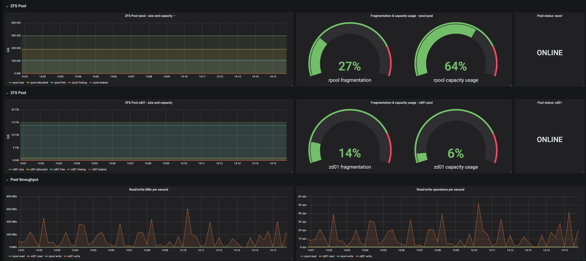

# Grafana dashboard for ZFS filesystem monitoring with Prometheus and Telegraf

## Pre-requirements
1. [Prometheus](https://prometheus.io/) is installed and configured
2. [Grafana](https://grafana.com/) is installed and configured
3. [Telegraf](https://github.com/influxdata/telegraf) is installed and configured

## Installation:
1. [Enable ZFS Input Plugin](https://github.com/influxdata/telegraf/tree/master/plugins/inputs/zfs)
2. Enable Pool Metrics collection: set poolMetrics = true in telegraf.conf
3. Import this dashboard into Grafana [https://grafana.com/docs/grafana/latest/reference/export_import/](https://grafana.com/docs/grafana/latest/reference/export_import/)
4. Profit!
